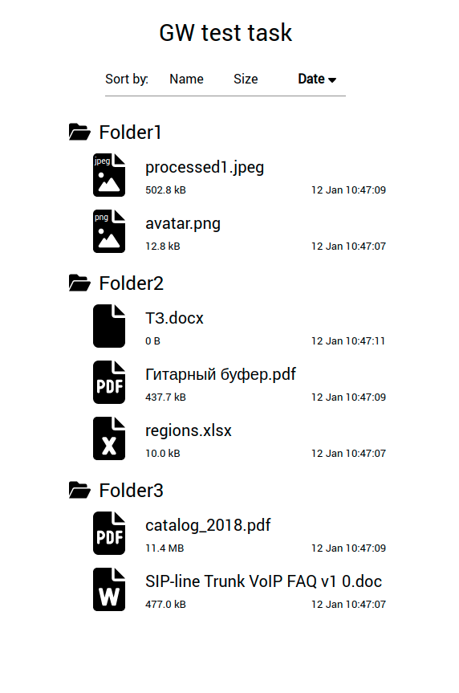

## Test task

It was formulated as:

It is necessary to write an ajax request to the server, get a json array in response with information about the files in the folder (names, size, creation and modification time), display as icons, as in the operating system. Adapt the view to the phone and laptop, add a switch to sort the output list of files by name, size, creation date. Save the selected sort as the default sort in cookies.

Time spent - 8h

### Scripts

```
yarn
yarn start
```

https://localhost:3000
